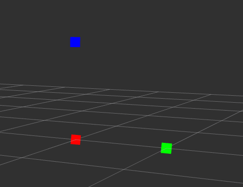

# test_code

로봇 제작간에 필요한 시험 코드들을 저장합니다. 각각 폴더로 구분하고 용도, 설치, 사용법, 사용결과를 기술합니다.

## mesh_publish 
### 용도 
- 3가지 색깔을 가진 3차원 sensor_msgs::pointcloud2 메시지를 publish합니다.
- unity상에서 메쉬를 전달하기 위한 데이터가 잘 전달되는지 확인합니다.

### 설치
1. ROS의 catkin_workspace의 src 디렉토리에 해당 폴더를 저장합니다. 
2. catkin_workspace로 이동후에, catkin_make 명렁어를 입력합니다.

### 사용법
1. 아래의 명령어를 입력해서 노드를 실행합니다.
```
rosrun mesh_publish demo_mesh_publish
```

2. rviz나 unity를 통해서 정보를 확인합니다. 
- publish type : pointcloud2
- frame : map
- topic name : /mesh_dat 

### 사용결과
: 3개의 점들이 관측된다.


